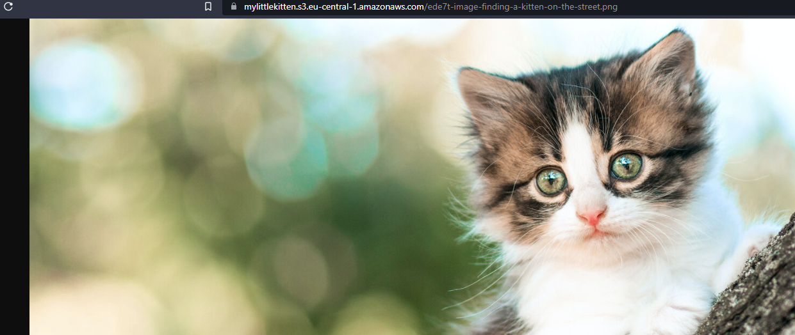

# S3
Simple Storage Service (S3) is an object storate service provided by AWS. It is a cloud storage service that stores data in buckets. And can be accessed using a REST API.

AWS makes certain that the file is stored durably. Your files are replicated accross the Availability Zones in your region. AWS claims that their durability is 99.999999999% (11 9's) and an availability of 99.99%.

Buckets are stored within a region. However, its name should be unique globally and it should be DNS compatible.

S3 has several storage classes through which you pay on a sliding scale for either free retrieval and a higher fee for storage, and a lower storage fee but you pay for retrieval.

## Key terminology
- [Object Storage](../descriptions/storage-types.md#Object)
- Storage Classes:
    - Standard
    - Infrequent Access (IA)
    - Glacier
    - Deep Glacier
    - Inteligent Tiering
- Durability: The chance of data loss.
- Availability: The chance that a file is available.
- REST etc
- DNS etc
- etc

## Exercise
### Used Sources
- https://aws.amazon.com/s3/
- https://aws.amazon.com/s3/storage-classes/?nc=sn&loc=3
- https://www.backblaze.com/blog/cloud-storage-durability-vs-availability/
- https://wellarchitectedlabs.com/common/documentation/createnews3bucketandaddobjects/

### Overcome challanges
- At first I couldn't access my own files through the browser.
    - I searched for `Access denied S3 bucket` on Google and found a solution.
    - I had to update the access permissions to allow the public to access the bucket.

### Results 
My teammembers were able to download my photos.
